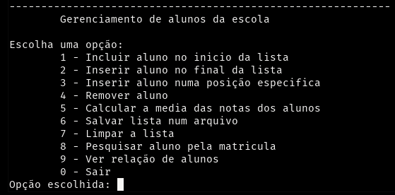

# Sobre o exercicio
---
Este exercício foi desenvolvido por mim para fins acadêmicos, para colocar em pratica os ensinamentos sobre estrutura de dados do tipo **Lista Dinamica (sem descritor)** ministrados no curso de Sistemas de Informação da UFES de Alegre - ES

### Qual a finalidade do exercicio?
---
A ideia é entender como funciona a manipulação de ponteiros usando nós, num sistema de controle de alunos. 


### O que compõem esse script?
---
De inicio, é apresentado ao usuário um menu com algumas opções para manipular informações de alunos. Proximo passo é usar descritor e adicionar mais funções.

### Como compilar
```bash
gcc controleAlunos -o controleAlunos
```

# Autor
Pedro Eugênio
https://www.linkedin.com/in/opedroeugenio/